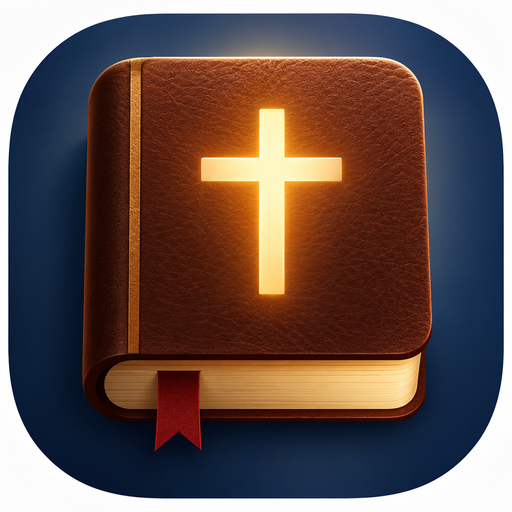

<div align="center">



# JasonBible

**A fast, fully offline Bible reader & note-taking app for Linux, Windows & macOS.**

90+ translations · 52 languages · word study with Strong's numbers · rich notes editor

[](https://github.com/BacroXP/JasonBible/releases)
[](https://github.com/BacroXP/JasonBible/actions)
[](https://github.com/BacroXP/JasonBible)
[](https://opensource.org/licenses/MIT)

**[⬇️ Download](#download)** · **[✨ Features](#features)** · **[🗺 Version history](#-version-history)** · **[⌨️ Shortcuts](#keyboard-shortcuts)** · **[🚀 Build & Run](#build--run)** · **[📸 Screenshots](#screenshots)** · **[🔗 Links](#links)**

</div>

---

## ⬇️ Download

Grab the installer for your platform from the
**[Releases](https://github.com/BacroXP/JasonBible/releases)** page — every release
ships all three, built automatically by CI on each native OS:

| Platform | Installer | Install with |
|----------|-----------|--------------|
| 🐧 Linux | `.deb` | `sudo apt install ./bibleapp_<version>_amd64.deb` (or the apt repo below) |
| 🪟 Windows | `.msi` | double-click the installer |
| 🍎 macOS | `.dmg` | open and drag to *Applications* |

> Installers aren't committed to the repo (they'd exceed GitHub's per-file limit) —
> they're attached to each release instead. No internet is needed after install:
> every translation ships inside the app.

### 🐧 Linux — apt repository (recommended)

Add the BibleApp apt repo once, then install and update like any other package:

```bash
echo "deb [trusted=yes] https://github.com/BacroXP/JasonBible/releases/latest/download ./" | sudo tee /etc/apt/sources.list.d/bibleapp.list
sudo apt update
sudo apt install bibleapp
```

Upgrade to new versions with `sudo apt upgrade bibleapp`.

> The repo is **unsigned**, hence the `[trusted=yes]` flag — packages are still
> checksum-verified against the index (SHA256). The index and the installer
> are both served from the GitHub Release download URL — GitHub redirects
> each file there, so the ~360 MB `.deb` never has to live in the repo
> itself. `apt update` may print a warning about a missing *Release* file —
> expected for an unsigned flat repo, harmless.

## ✨ Features

| 📖 Read & study | 📝 Notes & organize |
|---|---|
| **90+ translations in 52 languages** — from Luther 1912 to the Greek & Hebrew originals, switchable in Settings | Word-style **ribbon toolbar** with Home / Insert / Layout tabs |
| **Word study with Strong's numbers** — tap any `G`/`H` number for the definition, root & pronunciation; Greek **TVM codes** explain tense / voice / mood | Rich formatting: **H1/H2 headings, quotes, highlights, lists, bold / italic / underline** |
| **Interlinear view (ΑΩ)** — matching Greek beneath each verse, or **word-aligned** columns paired by Strong's number | **Media references** — `@youtube:…`, `@spotify:…`, `@url:…` render as chips with an in-app preview panel |
| **Full-text Bible search (Ctrl+F)** — grouped by book, case/whole-word toggles, scope filter, plus **Strong's reverse concordance** (`G25`, `H1`) | **Global notes search (Ctrl+Shift+F)** — full-text across every note, click-to-open |
| **Jump to any verse (Ctrl+G)** with book autocomplete, plus ← / → history | **`$Joh` inline autocomplete** — type a book and complete the reference |
| Whole-book **continuous reading** mode | Copy verses/ranges, **export chapters & notes to PDF** |
| **365-day reading plan** with progress, plus a daily verse on Home | Auto-save to disk · undo/redo · find & replace |
| Verse highlighting (5 colors), tags, read-tracking & favorites | Notes are plain `.note` files in `~/.bibleapp/notes` |
| **Split view** — read and take notes side by side | Dark / light theme, zoom (75–200 %), sound effects, DE / EN UI |

## 🗺 Version history

| Version | Focus | Status |
|---------|-------|--------|
| **v1.0.0** | General — Bible reading & notes | ✅ Released |
| **v2.0.0** | Media — in-app playback & rich media cards | 🚧 In development |
| **v3.0.0** | Accounts — sync & cloud | 🗓 Planned |

**v1.0.0 — the general app** *(released)*
The core reader & note-taking experience: 90+ offline translations in 52
languages, word study with Strong's numbers, interlinear / word-aligned
views, full-text Bible search, the Word-style ribbon notes editor with rich
formatting, 365-day reading plan, PDF export, split view, highlighting,
themes and the full shortcut set.

**v2.0.0 — media** *(in development)*
Media becomes a first-class citizen of your notes. `@youtube:…`,
`@spotify:…`, `@vimeo:…`, `@soundcloud:…`, `@url:…` and `@file:…` tokens
render as rich chips & cards with live titles, thumbnails and progress.
An **in-app media player** plays YouTube, Vimeo, SoundCloud & local files
(streams resolved by the bundled yt-dlp) and embeds Spotify — with pause,
stop and a **loop-forever** toggle. `@Phrase` autocomplete searches YouTube
live, and a hover-out media panel docks under the editor for quick access.

**v3.0.0 — accounts** *(planned)*
User accounts with cloud sync for notes, settings and reading progress — so
your library follows you across devices.

## ⌨️ Keyboard shortcuts

| Shortcut | Action | Shortcut | Action |
|----------|--------|----------|--------|
| `Ctrl+F` | Find — Bible search / in-note find | `Ctrl+Shift+F` | Global notes search |
| `Ctrl+H` | Find & replace | `Ctrl+G` | Jump to verse |
| `Ctrl+K` | Insert Bible reference | `Ctrl+Shift+K` | Insert book reference |
| `Ctrl+S` | Save note | `Ctrl+P` | Export note to PDF |
| `Ctrl+Z` / `Ctrl+Y` | Undo / redo | `Ctrl+A` | Select all |
| `Ctrl+B` / `Ctrl+I` / `Ctrl+U` | Bold / italic / underline | `Ctrl+←` / `Ctrl+→` | Jump word (add `Shift` to select) |
| `Ctrl+W` | Back / close | `Esc` | Close search / find bar |

## 🚀 Build & Run

Requires **Java 17+** (JDK).

```bash
git clone https://github.com/BacroXP/JasonBible.git
cd JasonBible

./gradlew run            # run from source
./gradlew desktopTest    # run the unit tests
./gradlew packageDeb     # build the Linux .deb (packageDmg / packageMsi on macOS / Windows)
```

Output lands in `build/compose/binaries/main/`. Shipping a new version?
Follow **[RELEASING.md](RELEASING.md)** — commit, tag `vX.Y.Z`, and CI builds &
attaches all three installers to a new release automatically.

## 📸 Screenshots

*On the way 🚧* — drop real screenshots into `docs/screenshots/` and reference
them here, e.g.:


## 🗂 Where things live

| What | Where |
|------|-------|
| Settings | `~/.bibleapp/private.json` |
| Notes | `~/.bibleapp/notes/*.note` |
| Translations | `src/desktopMain/resources/bible/` (auto-detected on startup) |

## 🔗 Links

- **⬇️ Releases & installers** — https://github.com/BacroXP/JasonBible/releases
- **🛠 CI pipeline** — https://github.com/BacroXP/JasonBible/actions
- **📦 Release guide** — [RELEASING.md](RELEASING.md)
- **🧱 Tech stack** — [Kotlin](https://kotlinlang.org) 2.2 · [Compose Multiplatform](https://www.jetbrains.com/lp/compose-multiplatform/) 1.9 (Material 3) · kotlinx-serialization · Apache PDFBox
